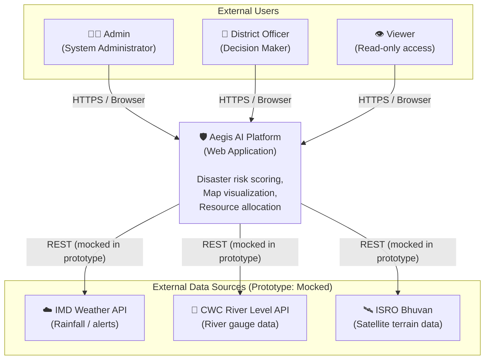
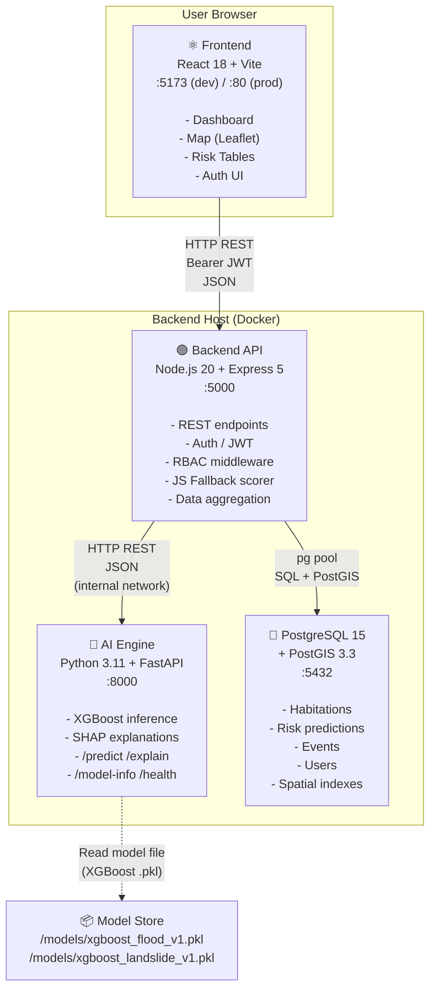
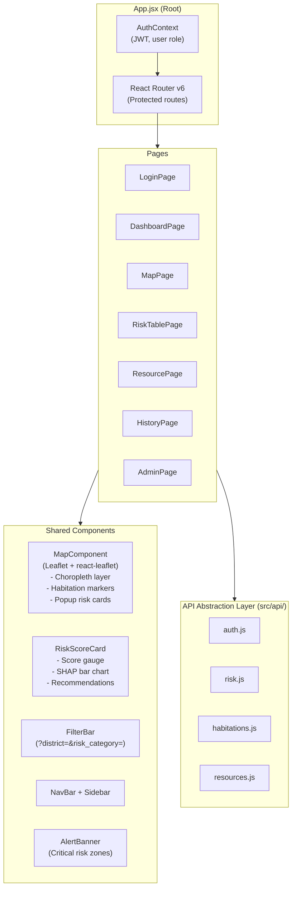
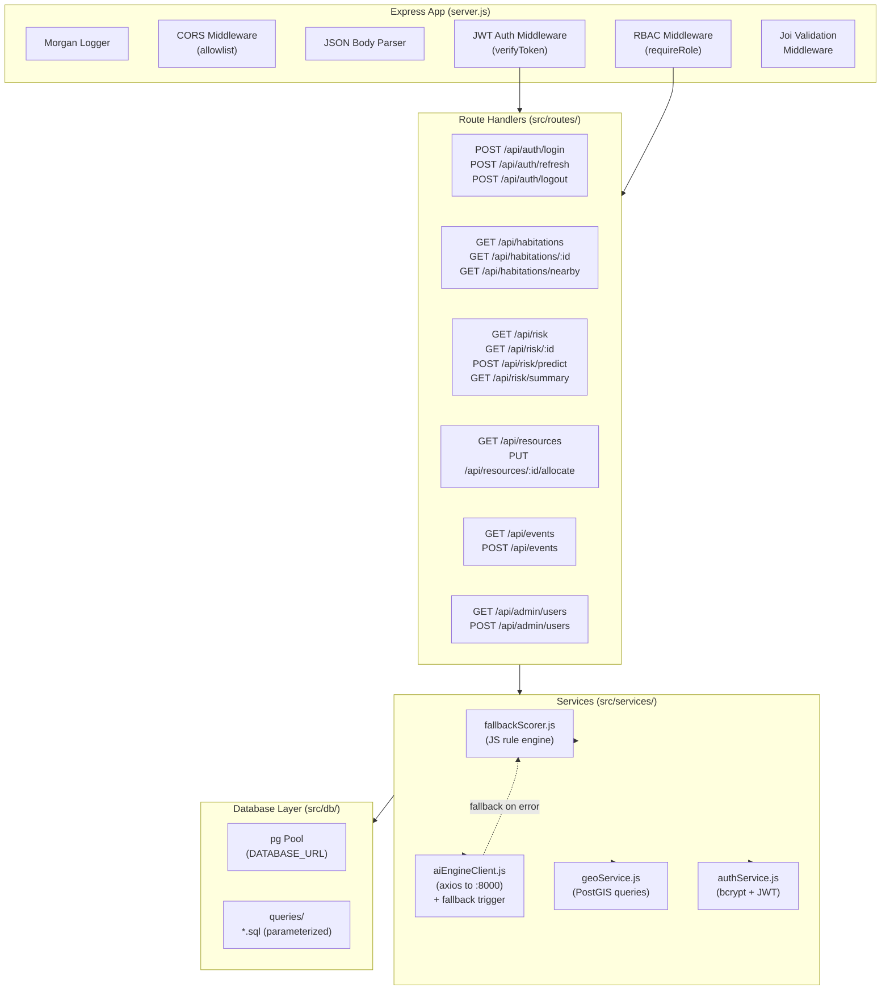
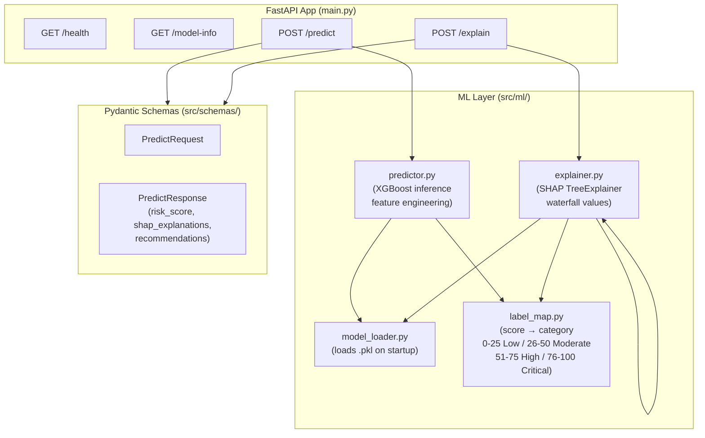
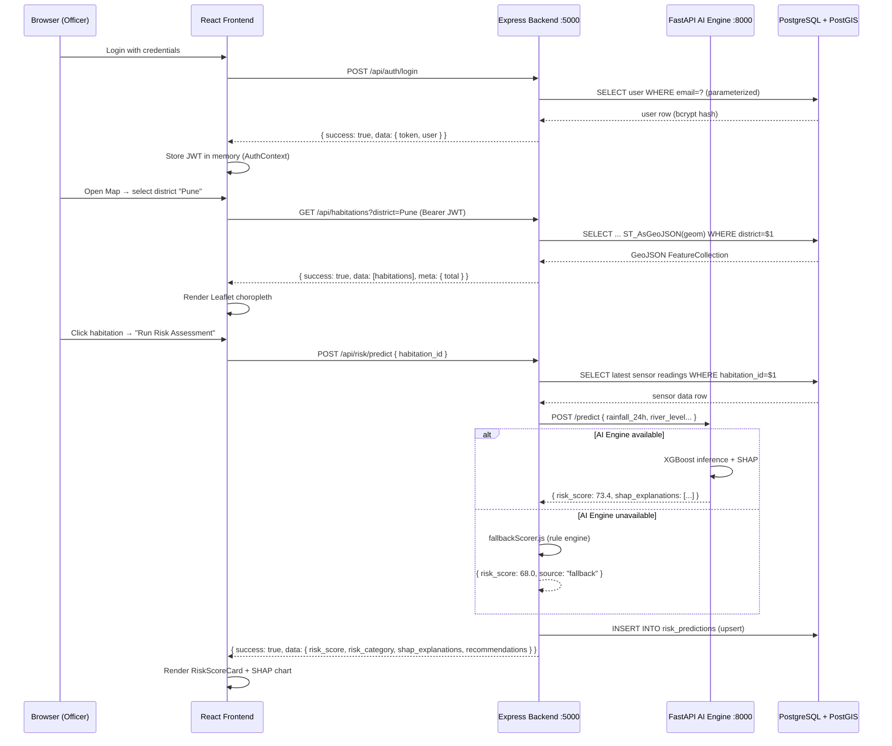

# Aegis AI — Disaster Decision Intelligence Platform
## System Architecture Document
**SIH26191 | Version 1.0.0 | 2026-09-28**

> **PROTOTYPE NOTICE**: Synthetic data only. Not for operational use.

---

## Table of Contents

1. [Executive Summary](#executive-summary)
2. [Architecture Principles](#architecture-principles)
3. [System Context Diagram](#system-context-diagram)
4. [Container Diagram](#container-diagram)
5. [Component Diagrams](#component-diagrams)
6. [Data Flow Diagram](#data-flow-diagram)
7. [Technology Decision Records](#technology-decision-records)

---

## 1. Executive Summary

Aegis AI is a multi-tier web application that provides district-level disaster risk intelligence for flood and landslide events in Maharashtra, India. The platform ingests geospatial, meteorological, and demographic data, runs it through a trained XGBoost ensemble model with SHAP explainability, and surfaces actionable risk scores and evacuation recommendations to civil defense officers via a React dashboard.

**Key Capabilities:**
- Real-time risk scoring (flood + landslide) per habitation using XGBoost + SHAP
- Interactive geospatial map with district/tehsil/habitation drill-down (Leaflet + PostGIS)
- Resource allocation engine (shelters, relief camps, vehicles)
- Historical event timeline and trend analytics
- Full offline fallback via a JavaScript rule-based scoring engine
- Role-Based Access Control (Viewer / Officer / Admin)

**Deployment Target:** Single-host Docker Compose (prototype); horizontally scalable to Kubernetes for production.

---

## 2. Architecture Principles

| Principle | Rationale | Implementation |
|-----------|-----------|----------------|
| **Scalability** | Risk data grows with habitations and events | Stateless API + connection-pooled DB; horizontal scaling via Docker replicas |
| **Security** | Sensitive population/location data | JWT authentication, RBAC, parameterized queries, CORS allowlist |
| **Explainability** | Government accountability for AI decisions | SHAP values surfaced per prediction; every score has a human-readable reason |
| **Offline-capable** | Field conditions may lack AI engine connectivity | JavaScript fallback scorer embedded in backend; caches last predictions in DB |
| **Separation of Concerns** | Three clearly-bounded services | Frontend (React), Backend API (Node/Express), AI Engine (Python/FastAPI) |
| **Observability** | Diagnosability in production | Structured JSON logs, `/health` endpoints on all services, error propagation chain |
| **Data Integrity** | Geospatial accuracy | All coordinates in WGS84 (EPSG:4326); PostGIS spatial indexes on all geo columns |

---

## 3. System Context Diagram (C4 Level 1)

---

## 4. Container Diagram (C4 Level 2)

---

## 5. Component Diagrams

### 5.1 Frontend Components

### 5.2 Backend API Components

### 5.3 AI Engine Components

---

## 6. Data Flow Diagram

---

## 7. Technology Decision Records

### TDR-001: XGBoost over Random Forest

| Factor | XGBoost | Random Forest |
|--------|---------|---------------|
| Accuracy on tabular data | Higher (gradient boosting) | Good |
| Inference speed | ~2ms per sample | ~5ms per sample |
| SHAP compatibility | Native TreeExplainer support | Supported but slower |
| Handling class imbalance | `scale_pos_weight` param | Requires manual resampling |
| Feature importance granularity | Per-sample SHAP values | Mean decrease impurity only |
| **Decision** | ✅ **Selected** | ❌ Rejected |

**Rationale:** XGBoost's per-sample SHAP explanations are critical for government accountability. The `scale_pos_weight` parameter handles the inherent imbalance in rare disaster event training data without resampling artifacts. Gradient boosting outperforms Random Forest on the structured/tabular meteorological + geospatial feature set used here.

---

### TDR-002: PostGIS over MongoDB

| Factor | PostGIS (PostgreSQL 15) | MongoDB |
|--------|------------------------|---------|
| Spatial query support | Native ST_Distance, ST_Within, ST_Buffer, ST_AsGeoJSON | Limited geospatial (2dsphere) |
| ACID transactions | Full ACID | Multi-document ACID (4.0+) |
| JOIN performance | Optimized with B-tree + GIST indexes | No native joins |
| Schema enforcement | Strong (prevents dirty data) | Schema-less (requires app-level validation) |
| Disaster data structure | Highly relational (habitations ↔ events ↔ predictions) | Document model forces denormalization |
| Team familiarity | SQL is universal | Requires MongoDB expertise |
| **Decision** | ✅ **Selected** | ❌ Rejected |

**Rationale:** Disaster data is inherently relational. Habitations have districts, tehsils, events, predictions, resources — all with foreign-key integrity requirements. PostGIS spatial functions (ST_Within for district-boundary queries, ST_Distance for nearest-shelter calculations) provide far richer geospatial capability than MongoDB's 2dsphere index.

---

### TDR-003: React + Vite over Next.js

| Factor | React + Vite | Next.js |
|--------|-------------|---------|
| Build speed (HMR) | <50ms HMR | 200-500ms HMR |
| Bundle complexity | Simple SPA | SSR/SSG adds ops complexity |
| SEO requirement | None (auth-gated dashboard) | SSR needed for SEO |
| Deployment | Static files → Nginx or CDN | Requires Node.js server |
| Offline capability | PWA via Vite plugin | More complex PWA setup |
| Learning curve | Lower for team | Higher (file-based routing, RSC) |
| **Decision** | ✅ **Selected** | ❌ Rejected |

**Rationale:** Aegis is an auth-gated operational dashboard — SEO is irrelevant. Vite's near-instant HMR significantly accelerates prototype iteration. Static output simplifies deployment (Nginx container). Next.js server-side complexity adds operational burden with no benefit for this use case.

---

### TDR-004: Node.js + Express over FastAPI for Main API

| Factor | Node.js + Express | FastAPI (Python) |
|--------|------------------|------------------|
| I/O concurrency | Event loop; excellent for DB + HTTP I/O | Async but GIL-limited for CPU tasks |
| Shared language with frontend | JavaScript (JSON serialization is native) | Python (requires JSON marshaling) |
| Ecosystem for auth/JWT | jsonwebtoken, bcrypt, passport — mature | python-jose — less battle-tested |
| Geospatial client libs | pg + postgis queries via node-postgres | asyncpg — comparable |
| AI engine separation | Clean HTTP boundary → FastAPI for ML | Would merge concerns |
| **Decision** | ✅ **Selected** | ❌ (used only for AI Engine) |

**Rationale:** The main API's bottleneck is I/O (DB queries, AI engine calls), not CPU — Node.js's event loop excels here. Keeping the ML workload in FastAPI/Python preserves access to the full Python ML ecosystem (XGBoost, SHAP, scikit-learn) without polluting the API service. The two-service split creates a clean, independently-scalable boundary.

---

### TDR-005: Leaflet over MapboxGL

| Factor | Leaflet + react-leaflet | MapboxGL JS |
|--------|------------------------|-------------|
| License | BSD-2 (fully open source) | Proprietary (requires API key + billing) |
| Tile sources | Any XYZ source (OpenStreetMap, ISRO Bhuvan) | Mapbox tiles (paid) or custom |
| Bundle size | ~145KB | ~920KB |
| Offline tile support | Yes (tile caching plugins) | Complex offline setup |
| Custom overlays | GeoJSON + custom panes | GL layers (more powerful but complex) |
| Prototype speed | Rapid with react-leaflet components | Longer setup time |
| **Decision** | ✅ **Selected** | ❌ Rejected |

**Rationale:** Government prototype cannot depend on Mapbox billing. Leaflet's open-source model with OpenStreetMap tiles (or ISRO Bhuvan WMS for India-specific layers) is zero-cost and production-viable. The smaller bundle size improves load times in low-bandwidth field conditions. GeoJSON overlay support is fully sufficient for district/tehsil choropleth rendering.

---

*Document Owner: Solution Architect | Last Updated: 2026-09-28 | Version: 1.0.0*
