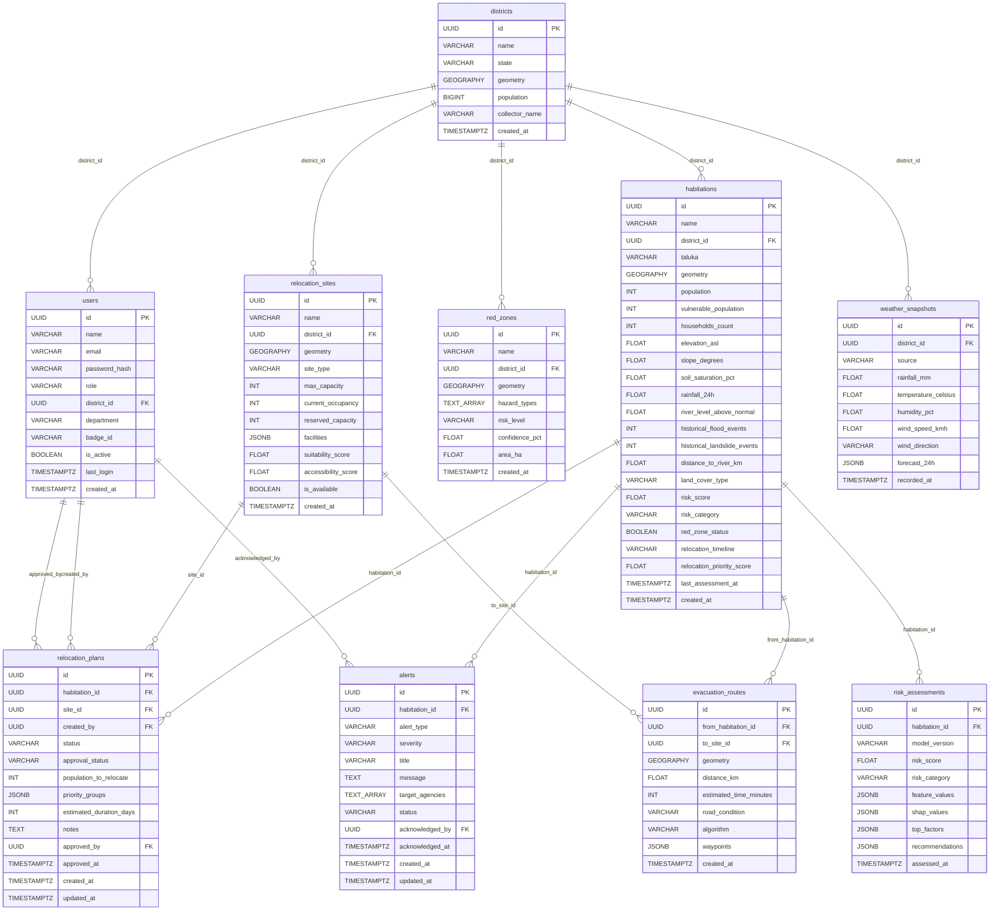

# Aegis AI — Database Schema Documentation

> **Platform:** SIH26191 — Disaster Decision Intelligence Platform  
> **Engine:** PostgreSQL 15+ with PostGIS 3.x  
> **Schema version:** `001_initial_schema.sql`  
> **Coordinate system:** EPSG:4326 (WGS-84) for all geography columns  

---

## Table of Contents
1. [Extensions](#extensions)
2. [Tables](#tables)
3. [Indexes](#indexes)
4. [Views](#views)
5. [Constraints & Business Rules](#constraints--business-rules)
6. [ER Diagram](#er-diagram)

---

## Extensions

| Extension | Purpose |
|-----------|---------|
| `postgis` | Geography/geometry types, spatial functions |
| `uuid-ossp` | `uuid_generate_v4()` |
| `pgcrypto` | `gen_random_uuid()` (preferred UUID generator) |

---

## Tables

### `users`

Platform users across all roles and departments.

| Column | Type | Nullable | Default | Notes |
|--------|------|----------|---------|-------|
| `id` | UUID | NOT NULL | `gen_random_uuid()` | Primary key |
| `name` | VARCHAR(255) | NOT NULL | — | Full name |
| `email` | VARCHAR(255) | NOT NULL | — | UNIQUE; format validated |
| `password_hash` | VARCHAR(255) | NOT NULL | — | bcrypt hash, never plaintext |
| `role` | VARCHAR(50) | NOT NULL | — | See role enum below |
| `district_id` | UUID | NULL | — | FK → `districts.id` (SET NULL on delete) |
| `department` | VARCHAR(255) | NULL | — | Government department name |
| `badge_id` | VARCHAR(100) | NULL | — | Official ID for field verification |
| `is_active` | BOOLEAN | NOT NULL | `TRUE` | Soft-delete flag |
| `last_login` | TIMESTAMPTZ | NULL | — | Set on successful authentication |
| `created_at` | TIMESTAMPTZ | NOT NULL | `NOW()` | Immutable audit timestamp |

**Role enum** (CHECK constraint):  
`super_admin` › `district_officer` › `disaster_officer` › `police_officer` › `health_officer` › `field_officer` › `citizen`

---

### `districts`

Administrative district boundaries with demographic data.

| Column | Type | Nullable | Default | Notes |
|--------|------|----------|---------|-------|
| `id` | UUID | NOT NULL | `gen_random_uuid()` | Primary key |
| `name` | VARCHAR(255) | NOT NULL | — | District name |
| `state` | VARCHAR(255) | NOT NULL | `'Maharashtra'` | State name |
| `geometry` | GEOGRAPHY(POLYGON, 4326) | NOT NULL | — | District boundary polygon |
| `population` | BIGINT | NULL | — | Census population |
| `collector_name` | VARCHAR(255) | NULL | — | District Collector (IAS officer) |
| `created_at` | TIMESTAMPTZ | NOT NULL | `NOW()` | — |

---

### `habitations`

Villages/habitations — primary unit of disaster risk assessment and relocation.

| Column | Type | Nullable | Default | Notes |
|--------|------|----------|---------|-------|
| `id` | UUID | NOT NULL | `gen_random_uuid()` | Primary key |
| `name` | VARCHAR(255) | NOT NULL | — | Village/habitation name |
| `district_id` | UUID | NOT NULL | — | FK → `districts.id` CASCADE |
| `taluka` | VARCHAR(255) | NULL | — | Sub-district administrative unit |
| `geometry` | GEOGRAPHY(POINT, 4326) | NOT NULL | — | Centroid point |
| `population` | INT | NULL | — | Total population |
| `vulnerable_population` | INT | NULL | — | Elderly + children + disabled |
| `households_count` | INT | NULL | — | Number of households |
| `elevation_asl` | FLOAT | NULL | — | Metres above sea level |
| `slope_degrees` | FLOAT | NULL | — | Terrain slope 0–90° |
| `soil_saturation_pct` | FLOAT | NULL | — | 0–100% |
| `rainfall_24h` | FLOAT | NULL | — | mm in last 24 hours |
| `river_level_above_normal` | FLOAT | NULL | — | Metres above normal river level |
| `historical_flood_events` | INT | NULL | `0` | Count of past flood events |
| `historical_landslide_events` | INT | NULL | `0` | Count of past landslide events |
| `distance_to_river_km` | FLOAT | NULL | — | km to nearest river |
| `land_cover_type` | VARCHAR(100) | NULL | — | forest / agricultural / urban / coastal |
| `risk_score` | FLOAT | NULL | — | Composite ML score 0–100 |
| `risk_category` | VARCHAR(20) | NULL | — | Low / Moderate / High / Critical |
| `red_zone_status` | BOOLEAN | NOT NULL | `FALSE` | Official red-zone designation |
| `relocation_timeline` | VARCHAR(255) | NULL | — | Human-readable urgency string |
| `relocation_priority_score` | FLOAT | NULL | — | Weighted priority queue score |
| `last_assessment_at` | TIMESTAMPTZ | NULL | — | Last ML assessment time |
| `created_at` | TIMESTAMPTZ | NOT NULL | `NOW()` | — |

> **Computed vs Stored:** `risk_score` and `risk_category` are **stored** (denormalized from latest `risk_assessments` row) for fast filtering. The canonical audit record is in `risk_assessments`.

---

### `red_zones`

Official hazard zone polygons declared by authorities or ML pipeline.

| Column | Type | Nullable | Default | Notes |
|--------|------|----------|---------|-------|
| `id` | UUID | NOT NULL | `gen_random_uuid()` | Primary key |
| `name` | VARCHAR(255) | NOT NULL | — | Zone identifier name |
| `district_id` | UUID | NOT NULL | — | FK → `districts.id` CASCADE |
| `geometry` | GEOGRAPHY(POLYGON, 4326) | NOT NULL | — | Hazard zone boundary |
| `hazard_types` | TEXT[] | NOT NULL | `'{}'` | Array: flood, landslide, cyclone… |
| `risk_level` | VARCHAR(20) | NOT NULL | — | Low / Moderate / High / Critical |
| `confidence_pct` | FLOAT | NULL | — | ML model confidence 0–100 |
| `area_ha` | FLOAT | NULL | — | Area in hectares |
| `created_at` | TIMESTAMPTZ | NOT NULL | `NOW()` | — |

---

### `relocation_sites`

Candidate and active sites for housing relocated populations.

| Column | Type | Nullable | Default | Notes |
|--------|------|----------|---------|-------|
| `id` | UUID | NOT NULL | `gen_random_uuid()` | Primary key |
| `name` | VARCHAR(255) | NOT NULL | — | Site name |
| `district_id` | UUID | NOT NULL | — | FK → `districts.id` CASCADE |
| `geometry` | GEOGRAPHY(POINT, 4326) | NOT NULL | — | Site location |
| `site_type` | VARCHAR(100) | NULL | — | relief_camp / school / community_hall / permanent_colony |
| `max_capacity` | INT | NOT NULL | — | Total person capacity |
| `current_occupancy` | INT | NOT NULL | `0` | Current occupants |
| `reserved_capacity` | INT | NOT NULL | `0` | Reserved by pending plans |
| `facilities` | JSONB | NULL | — | `{"water":bool,"electricity":bool,...}` |
| `suitability_score` | FLOAT | NULL | — | 0–100 composite score |
| `accessibility_score` | FLOAT | NULL | — | 0–100 road access score |
| `is_available` | BOOLEAN | NOT NULL | `TRUE` | Available for new assignments |
| `created_at` | TIMESTAMPTZ | NOT NULL | `NOW()` | — |

**Computed field:** `available_capacity = max_capacity - current_occupancy - reserved_capacity`

---

### `evacuation_routes`

Pre-computed or AI-generated routes from habitations to relocation sites.

| Column | Type | Nullable | Default | Notes |
|--------|------|----------|---------|-------|
| `id` | UUID | NOT NULL | `gen_random_uuid()` | Primary key |
| `from_habitation_id` | UUID | NOT NULL | — | FK → `habitations.id` CASCADE |
| `to_site_id` | UUID | NOT NULL | — | FK → `relocation_sites.id` CASCADE |
| `geometry` | GEOGRAPHY(LINESTRING, 4326) | NOT NULL | — | Full road path |
| `distance_km` | FLOAT | NOT NULL | — | Total route distance |
| `estimated_time_minutes` | INT | NOT NULL | — | Estimated travel time |
| `road_condition` | VARCHAR(50) | NULL | — | good / fair / poor / blocked |
| `algorithm` | VARCHAR(50) | NOT NULL | `'A*'` | Routing algorithm used |
| `waypoints` | JSONB | NULL | — | Ordered `[{seq,lat,lng,name,notes}]` |
| `created_at` | TIMESTAMPTZ | NOT NULL | `NOW()` | — |

---

### `relocation_plans`

Plans linking a habitation to a destination site, with approval workflow.

| Column | Type | Nullable | Default | Notes |
|--------|------|----------|---------|-------|
| `id` | UUID | NOT NULL | `gen_random_uuid()` | Primary key |
| `habitation_id` | UUID | NOT NULL | — | FK → `habitations.id` CASCADE |
| `site_id` | UUID | NOT NULL | — | FK → `relocation_sites.id` RESTRICT |
| `created_by` | UUID | NOT NULL | — | FK → `users.id` RESTRICT |
| `status` | VARCHAR(50) | NOT NULL | `'draft'` | draft / active / completed / cancelled |
| `approval_status` | VARCHAR(50) | NOT NULL | `'pending'` | pending / approved / rejected |
| `population_to_relocate` | INT | NOT NULL | — | Person count for this plan |
| `priority_groups` | JSONB | NULL | — | `[{group,count}]` demographic breakdown |
| `estimated_duration_days` | INT | NULL | — | Planned completion window |
| `notes` | TEXT | NULL | — | Free-form operational notes |
| `approved_by` | UUID | NULL | — | FK → `users.id` SET NULL |
| `approved_at` | TIMESTAMPTZ | NULL | — | Approval timestamp |
| `created_at` | TIMESTAMPTZ | NOT NULL | `NOW()` | — |
| `updated_at` | TIMESTAMPTZ | NOT NULL | `NOW()` | Auto-updated via trigger |

---

### `alerts`

Disaster alerts issued for habitations, routed to target agencies.

| Column | Type | Nullable | Default | Notes |
|--------|------|----------|---------|-------|
| `id` | UUID | NOT NULL | `gen_random_uuid()` | Primary key |
| `habitation_id` | UUID | NOT NULL | — | FK → `habitations.id` CASCADE |
| `alert_type` | VARCHAR(100) | NOT NULL | — | flood_warning / evacuation_order / landslide_watch / all_clear |
| `severity` | VARCHAR(20) | NOT NULL | — | info / warning / danger / critical |
| `title` | VARCHAR(255) | NOT NULL | — | Short display title |
| `message` | TEXT | NOT NULL | — | Full alert text |
| `target_agencies` | TEXT[] | NOT NULL | `'{}'` | NDRF / SDRF / police / health / collector |
| `status` | VARCHAR(50) | NOT NULL | `'active'` | active / acknowledged / resolved / expired |
| `acknowledged_by` | UUID | NULL | — | FK → `users.id` SET NULL |
| `acknowledged_at` | TIMESTAMPTZ | NULL | — | ACK timestamp |
| `created_at` | TIMESTAMPTZ | NOT NULL | `NOW()` | — |
| `updated_at` | TIMESTAMPTZ | NOT NULL | `NOW()` | Auto-updated via trigger |

---

### `risk_assessments`

Immutable audit log of every ML risk assessment run per habitation.

| Column | Type | Nullable | Default | Notes |
|--------|------|----------|---------|-------|
| `id` | UUID | NOT NULL | `gen_random_uuid()` | Primary key |
| `habitation_id` | UUID | NOT NULL | — | FK → `habitations.id` CASCADE |
| `model_version` | VARCHAR(50) | NOT NULL | — | e.g. `v1.2.0` |
| `risk_score` | FLOAT | NOT NULL | — | 0–100 |
| `risk_category` | VARCHAR(20) | NOT NULL | — | Low / Moderate / High / Critical |
| `feature_values` | JSONB | NULL | — | Input feature snapshot |
| `shap_values` | JSONB | NULL | — | SHAP per-feature explanations |
| `top_factors` | JSONB | NULL | — | `[{factor, shap_value, direction}]` |
| `recommendations` | JSONB | NULL | — | `[{action, priority, agency}]` |
| `assessed_at` | TIMESTAMPTZ | NOT NULL | `NOW()` | Assessment timestamp |

> **Append-only** — rows are never updated. Latest row per habitation via `v_habitation_latest_risk` view or `DISTINCT ON (habitation_id) ORDER BY assessed_at DESC`.

---

### `weather_snapshots`

Time-series weather data per district. Append-only.

| Column | Type | Nullable | Default | Notes |
|--------|------|----------|---------|-------|
| `id` | UUID | NOT NULL | `gen_random_uuid()` | Primary key |
| `district_id` | UUID | NOT NULL | — | FK → `districts.id` CASCADE |
| `source` | VARCHAR(100) | NOT NULL | `'synthetic'` | synthetic / IMD / MERRA-2 |
| `rainfall_mm` | FLOAT | NULL | — | Total rainfall mm |
| `temperature_celsius` | FLOAT | NULL | — | Air temperature |
| `humidity_pct` | FLOAT | NULL | — | 0–100% |
| `wind_speed_kmh` | FLOAT | NULL | — | Wind speed |
| `wind_direction` | VARCHAR(10) | NULL | — | N / NE / E / SE / S / SW / W / NW |
| `forecast_24h` | JSONB | NULL | — | Hourly forecast array |
| `recorded_at` | TIMESTAMPTZ | NOT NULL | `NOW()` | Observation timestamp |

---

## Indexes

| Index Name | Table | Column(s) | Type | Notes |
|---|---|---|---|---|
| `idx_districts_geometry` | districts | geometry | GIST | Spatial queries |
| `idx_habitations_geometry` | habitations | geometry | GIST | Spatial queries |
| `idx_red_zones_geometry` | red_zones | geometry | GIST | Spatial queries |
| `idx_relocation_sites_geometry` | relocation_sites | geometry | GIST | Spatial queries |
| `idx_evacuation_routes_geometry` | evacuation_routes | geometry | GIST | Spatial queries |
| `idx_habitations_district_id` | habitations | district_id | B-Tree | FK join |
| `idx_habitations_risk_score` | habitations | risk_score DESC | B-Tree | Risk ranking queries |
| `idx_habitations_risk_cat` | habitations | risk_category | B-Tree | Category filter |
| `idx_habitations_red_zone` | habitations | red_zone_status | Partial | WHERE red_zone_status=TRUE |
| `idx_alerts_status` | alerts | status | Partial | WHERE status='active' |
| `idx_relocation_sites_available` | relocation_sites | is_available | Partial | WHERE is_available=TRUE |
| `idx_risk_assessments_assessed_at` | risk_assessments | assessed_at DESC | B-Tree | Latest-first ordering |
| `idx_weather_snapshots_recorded_at` | weather_snapshots | recorded_at DESC | B-Tree | Latest-first ordering |

---

## Views

### `v_habitation_latest_risk`
Latest ML risk assessment per habitation. `DISTINCT ON (habitation_id) ORDER BY assessed_at DESC`.  
Joins: `risk_assessments` → `habitations` → `districts`.

### `v_active_relocation_plans`
All `status IN ('draft','active')` relocation plans with denormalized entity names.  
Joins: `relocation_plans` → `habitations` → `districts` → `relocation_sites` → `users`.

---

## Constraints & Business Rules

| Rule | Implementation |
|------|---------------|
| `approved` plan requires `approved_by` + `approved_at` | CHECK on `relocation_plans` |
| `acknowledged` alert requires `acknowledged_by` + `acknowledged_at` | CHECK on `alerts` |
| `current_occupancy ≤ max_capacity` | CHECK on `relocation_sites` |
| `reserved_capacity ≤ (max_capacity - current_occupancy)` | CHECK on `relocation_sites` |
| `vulnerable_population ≤ population` | CHECK on `habitations` |
| `soil_saturation_pct` in 0–100 | CHECK on `habitations` |
| `risk_score` in 0–100 | CHECK on `habitations` and `risk_assessments` |
| `updated_at` auto-refresh | Trigger on `relocation_plans`, `alerts` |
| Passwords never plaintext | Application-level + documented in column comment |

---

## ER Diagram

